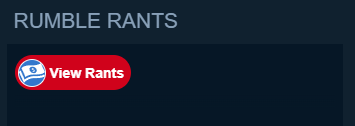
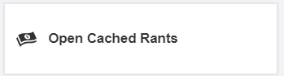
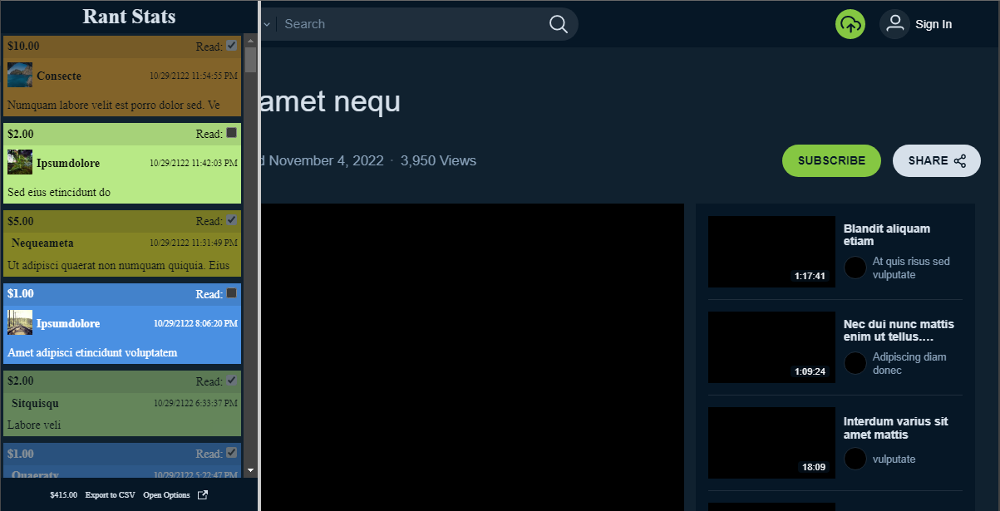
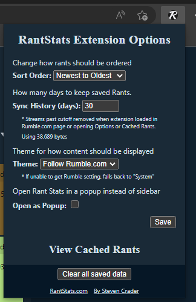
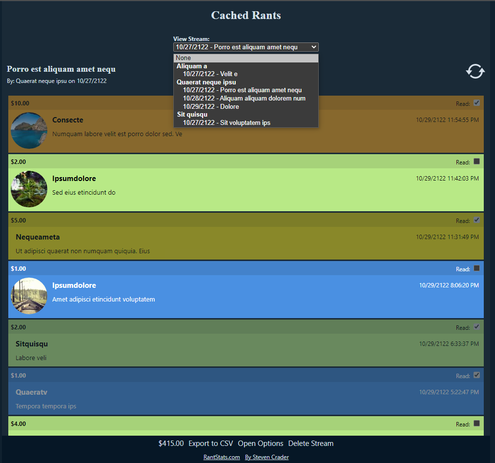

# RantStats Extension for Rumble.com

**WARNING:** this relies on undocumented features of Rumble. If Rumble changes their site, this may break.

Add support for capturing the paid Rumble Rants for [Rumble.com](https://rumble.com/) live streams.
Rants are shown past their normal expiration date in the chat.

Rants can be shown as a sidebar on the stream page or in a separate window. After a stream ends, cached data can be
viewed by loading the stream page again.

Additionally, all cached data can be viewed and managed from the Cached Rants page.

## Download

To add to your browser, download the extension from:

TODO: Chrome link
TODO: Edge link
TODO: Firefox link

**Permissions**

Extensions require the following permissions:

- `storage`: save options and stream data to local browser storage
- `unlimitedStorage`: removes storage limit (see current usage in options page)
- `tabs`: used to sync options and other data between pages running extension and to open the Cached Rants page

## Sidebar

Open the sidebar (or popup) by clicking the "View Rants" button in the chat area of a stream that is currently live or
the "Open Cached Rants" link on a stream archive page. 

 

Resize the sidebar by clicking and dragging the right border.

**Rant**

Paid Rumble Rants are show using the color scheme matching the dollar amount. 

Click the "Read" checkbox to mark the Rant read. Click it again to mark it unread.

**Total**

The total amount of all Rants cached is shown in the footer.

**Export to CSV**

This will download the cached Rants and stream dat to a CSV file.

May need to allow pop-ups for Rumble.com in order for download to work.

**Open Options**

Opens the Options Page in a new tab.

**Open as popup**

If open as a sidebar, click the "Open as popup" icon to open the sidebar in a popup window.

## Options Page

The following options are available by clicking on the extension icon or opening the standalone page.

### Options

**Sort Order**

Change the order Rants are displayed. Synced across all opened sidebars/popups and Cached Rants page.

Options: 

- `Oldest To Newest`: Sort Rants by the post date from oldest to newest (Default)
- `Newest To Oldest`: Sort Rants by the post date from newest to oldest
- `Highest To Lowest`: Sort Rants by the price from high to low
- `Lowest To Highest`: Sort Rants by the price from low to high

**Sync History**

How many days cached stream data should be stored. Data is removed when loading a page that includes the extension.

Number of bytes in use displayed on options page. 

To manually remove items, open the stream in the Cached Rants page and click "Delete Stream"

Options: 

- Minimum 1 day
- No maximum
- Default: 30 days

**Theme**

Specify the color theme to use for the extension sidebar and pages.

Options:

- `Follow Rumble.com`: Follow the theme of Rumble.com (Default)
- `System`: Follow the system's theme settings regardless of Rumble's settings
- `Dark`: Always use dark mode regardless of Rumble's settings
- `Light`: Always use light mode regardless of Rumble's settings

**Open as Popup**

Open the Rants viewer for the stream in a popup window instead of as a sidebar. 

Note: the sidebar can always be moved to a popup even if this isn't checked.

Options:

- Unchecked: display as sidebar (Default)
- Checked: open as popup

### Page Links

Click "View Cached Rants" to open the Cached Rants page

### Controls

Click the "Clear all saved data" button to remove all stored options and stream data. 
To only remove a specific stream, open the stream in the Cached Rants page.

## Cached Rants Page

All cached streams are shown in the dropdown grouped by the creator. Select the stream to view cached rants for.

**Stream Data**

The title, creator and first date stream data cached is shown below the stream dropdown. 

Click the refresh icon to refresh the displayed data.

**Rant**

Paid Rumble Rants are show using the color scheme matching the dollar amount. 

Click the "Read" checkbox to mark the Rant read. Click it again to mark it unread.

**Total**

The total amount of all Rants cached is shown in the footer.

**Export to CSV**

This will download the cached Rants and stream dat to a CSV file.

May need to allow pop-ups for Rumble.com in order for download to work.

**Open Options**

Opens the Options Page in a new tab.

**Delete Stream**

Delete the data for the selected stream.

## Changes

See [CHANGELOG](CHANGELOG.md)

## Development

1. Clone repo
2. Install Node and Yarn
3. Run `yarn install`
4. Build with `yarn run build`
5. Convert the `scsss` to `css` by running `yarn run build-sass`
6. Open browser's extension page (ex: `chrome://extensions/`)
7. Enable "Developer mode"
8. Click "Load unpacked" and select the output folder

## Support

If you want to support me:

- [PayPal](https://www.paypal.me/stevencrader)
- [$craders](https://www.cash.app/$craders)
- [Venmo](https://venmo.com/code?user_id=467277291978752568&created=1654152122)
- [Twitter](https://twitter.com/stevencrader)
